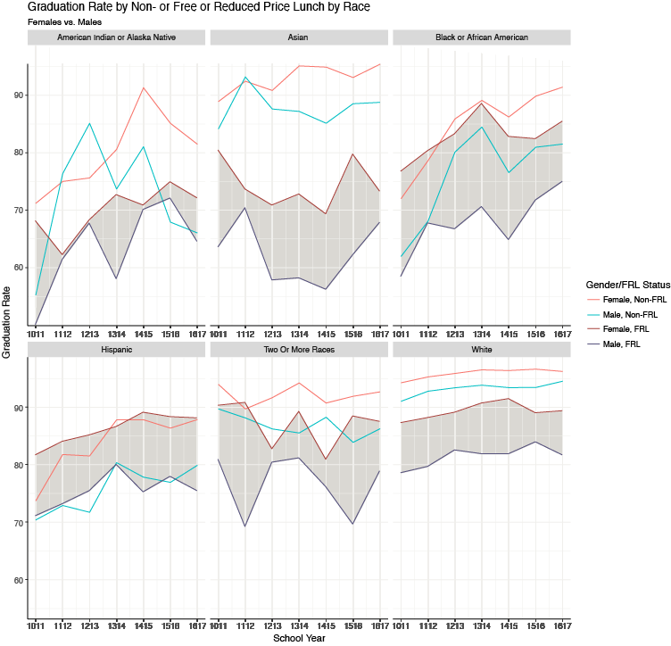
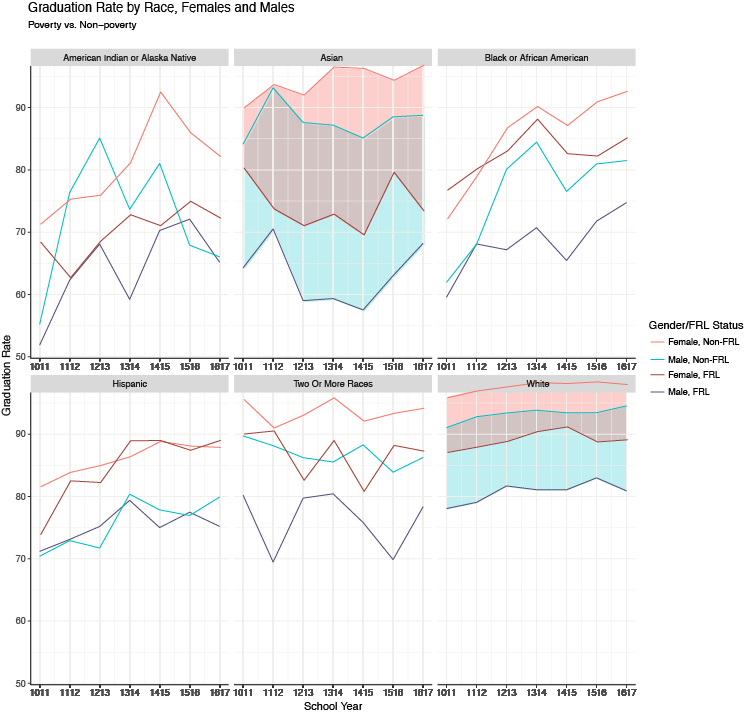
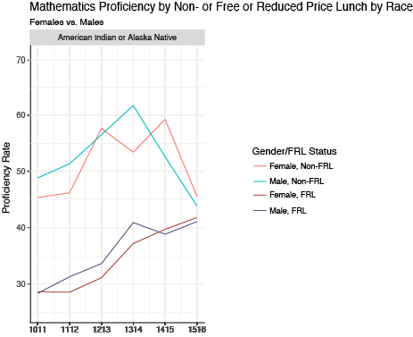
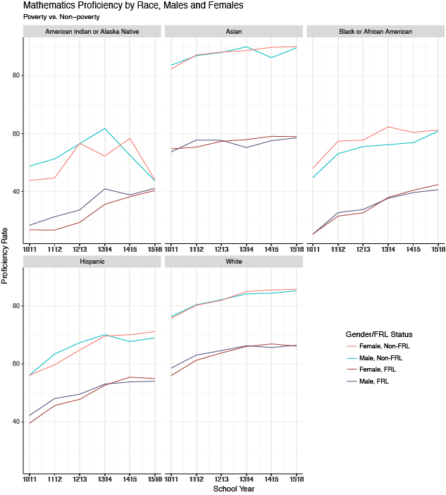
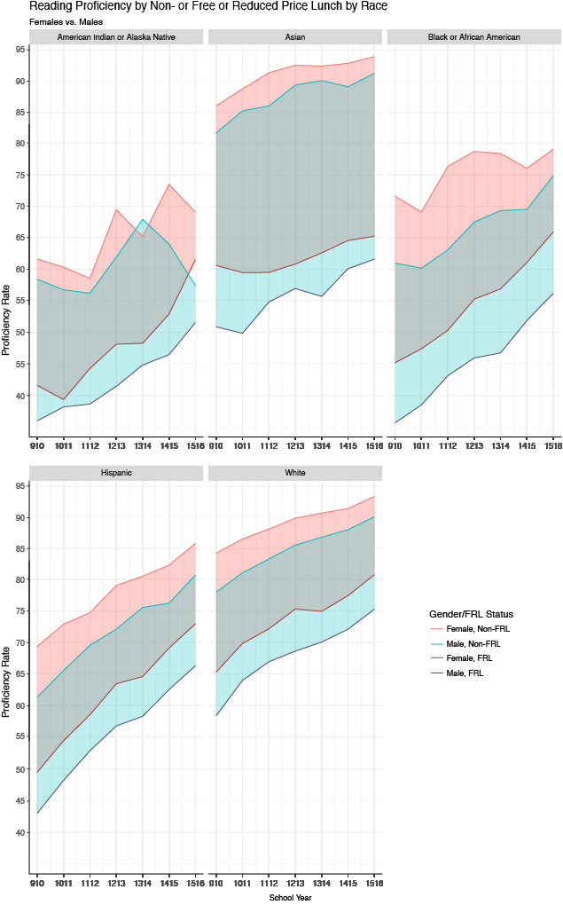
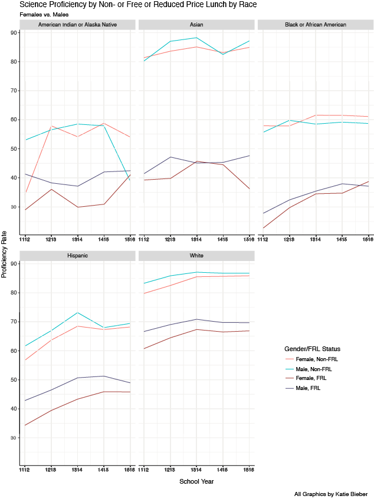

# Nebraska's K-12 Achievement Gap

Nebraska has good public schools. Graduation rates are consistently high. Average statewide attendance is 95 percent and the dropout rate is 1.09 percent, suggesting strong student engagement in their education experience. However, there are significant and persistent gaps in academic performance (proficiency) and educational attainment (graduation) among race, gender, and students from differing income levels. Below is an analysis of Nebraska public schools' graduation rates and composite proficiency rates by race. Nebraska students are assessed on proficiency of Reading and Mathematics in grades three through eight and Science in grades five and eight. The proficiency scores depicted are a composite of all grades testing in that area. The group Native Hawaiian or Pacific Islander has been filtered from all results as there are too few students to reveal specific numbers to the public. In addition, the group Two or More Races has been filtered from proficiency of Mathematics, Reading, and Science for the same reason.

## Graduation Rate
Graduation rates in Nebraska are at an all-time high, second only to Iowa in the nation. But there are disparities among groups. Males who are economically disadvantaged (Free or Reduced Lunch or FRL) are always outperformed by females in the same category for graduation rates in Nebraska in every race. With the exception of American Indian and Alaskan Native, and the 2011-2012 school year for Asians, females also outperform males when both groups live above the poverty line (Not Free or Reduced Lunch or Non-FRL). Females and males living in poverty have graduation rates that fluctuate overtime but non-poverty students, both male and female, seem to have an upward trend line. The gap between males and females has persisted over time and does not appear to be lessening.

When looking at graduation rates by males only, poverty and non-poverty students have more overlap, especially among American Indian or Alaska Native, Black or African American, and Hispanic races. Similarly, females by non-poverty and poverty have overlap for Black or African American and Hispanic races. This would suggest that there is less of a gap among these races by gender, especially, it would seem, among Hispanics where lines overlap several times. Alternatively, Asians have a very large gap among the same gender but differing income status, between 15 and 20 percent. Whites also have a consistent gap, whether male or female, but to a lesser degree at 5-10 percent. Again this gap among Asians and Whites is significant and remaining so over time.

## Mathematics Proficiency
When comparing poverty with non-poverty students in Mathematics proficiency, females and males perform very similarly to one another. It is worth noting that, with the exception of non-poverty female and male American Indian or Alaska Natives, all races are on a steady uphill trend. One would expect that any group not experiencing poverty would be on an uphill climb to some degree, but American Indian or Alaska Natives are, in fact, going the opposite direction. Conversely, American Indian or Alaska Natives in poverty are going in a positive direction. This would indicate that this group has unique challenges than those of other races.

Comparing males, poverty versus non-poverty and females, poverty versus non-poverty, there is a large persistent gap that mirrors its counterpart almost exactly over time, save for American Indian or Alaska Native. Asians above the poverty line outperform every group with Whites, non-poverty following close behind. American Indian or Alaska Native and Black or African American perform at the lower end for both poverty and non-poverty groups.

## Reading Proficiency
Similar to Mathematics, males, poverty versus non-poverty and females, poverty versus non-poverty, show a large gap that mimics its counterpart almost exactly over time but for American Indian or Alaska Native. The comparison of poverty to non-poverty students yields similar results to Mathematics with female versus male students except that the gap has widened among gender. The mirrored upward trend line remains the same except as Mathematics for non-poverty American Indian or Alaska Natives. The significant and persistent gap between poverty and non-poverty students in Reading is alarming, hovering around 20 percentage points. Of course, gender matters in Reading proficiency but not nearly to the degree that income does in the achievement gap.

## Science Proficiency 
The comparison here of poverty to non-poverty students has a closer relationship to Mathematics than Reading in that the mirrored gap of males and females is fairly tight and sometimes intertwines in proficiency. Students in poverty in all races but White perform fairly similarly with White students in poverty outperforming all others. However, Asians not in poverty outperform all other non-poverty groups.

Again, as with Reading, males in poverty versus non-poverty and females in poverty versus non-poverty, show a large gap for all races. Most races have a gap of 20 percent for both genders between poverty and non-poverty. Both Asian females and males show a 40 percent gap between income status, a gap that does not appear to be shrinking.

## Looking Forward: Performance and Attainment
This compelling analysis begs for future studies and new approached concerning the achievement gap in Nebraska. For the state to make systematic and systemic improvements in graduation rates and proficiency in Mathematics, Reading, and Science, education stakeholders will need to target all minority groups in poverty as economic conditions are the key factor to success or failure on state test proficiency and high school degree attainment. Those in poverty seem to have a less pronounced difference for graduation than for proficiency in Mathematics, Reading, and Science. This would lead one to believe that graduation and proficiency are not necessarily tied together and that a student who is not proficient in the three academic areas tested may still graduate. This deserves more research and thought. 

A targeted approach for males in all minority groups would certainly help to improve scores and attainment over time but not to the degree of helping those in poverty for both genders would. Interventions and support for these groups will most decidedly reduce the achievement gap, increase graduation rates, and increase proficiency overall. Focused attention should be paid to American Indian and Alaska Natives as the data shows their needs are different from other groups, specifically in Mathematics.

More Nebraska education data can be found on the Nebraska Education Profile website at [text to be linked](http://nep.education.ne.gov).